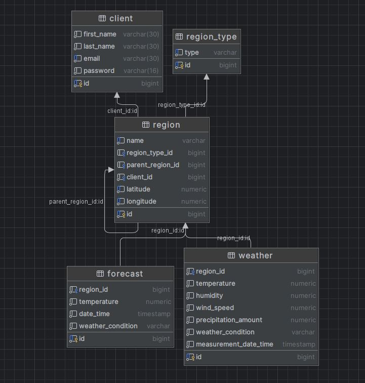

# Решение олимпиады "IT-Планета 2024"

## Направление "Прикладное программирование if...else"
> Автор решения: Махмутов Адель Наилевич  
telegram: @Vodypep  
## Легенда
Ваша компания «История Погоды» специализируется на сборе и анализе метеорологических
данных в стране «Климатика». Важность отслеживания погодных условий неоценима, особенно
в свете глобальных климатических изменений. Эти данные используются для прогнозирования
погоды, изучения климатических изменений и помощи в сельском хозяйстве.
В этом году ваша компания решила создать централизованную базу данных, которая объединит
все исторические метеорологические записи для долгосрочных исследований климатических
паттернов, а также для обеспечения более точных и своевременных погодных прогнозов.

## Запуск приложения
1. Перейдите в директорию проекта
2. Соберите jar файл приложения при помощи команды: `./gradlew bootJar`
3. По желанию настройте переменные окружения в [.env](.env) файле.
4. Запустите docker-compose файл при помощи команды: `docker-compose up`

## Описание решения
Для написания программы использовался следующий стек технологий:
* Java
* Spring Boot (Web, Data Jpa, Security, Validation)
* OpenAPI
* PostgreSQL
* Liquibase
* Lombok
* Mapstruct

Все используемые библиотеки находятся в файле [libs.versions.toml](gradle/libs.versions.toml).  
Файл [weather-app.yaml](src/main/resources/openapi/weather-app.yaml) содержит описание всех методов контроллеров, которое доступно по адресу `http://localhost:8080/swagger-ui/index.html`.  
В папке [changelog](src/main/resources/db/changelog) содержатся sql скрипты миграций, которые используются при помощи liquibase для создания таблиц в базе данных.  
Файл [.env](.env) является конфигурационным файлом, содержащий переменные окружения, которые используются в [docker-compose](compose.yaml) файле.

**По умолчанию приложение запускается внутри докера на хосте localhost и порту 8080.**  

В качестве архитектуры приложения была выбрана многослойная архитектура.  
Основной функционал расположен в пакете [core](src/main/java/ru/adel/if_else_task_2/core), где описаны сущности, сервисы для работы с базой данных, бизнес логика и конфигурация приложения.  
В пакете [controller](src/main/java/ru/adel/if_else_task_2/controller) расположен слой REST контроллеров.  
Пакет [public_interface](src/main/java/ru/adel/if_else_task_2/public_interface) является связующим слоем между слоем контроллеров и основным слоем.  

Ниже представлена схема базы данных, используемая в приложении:

